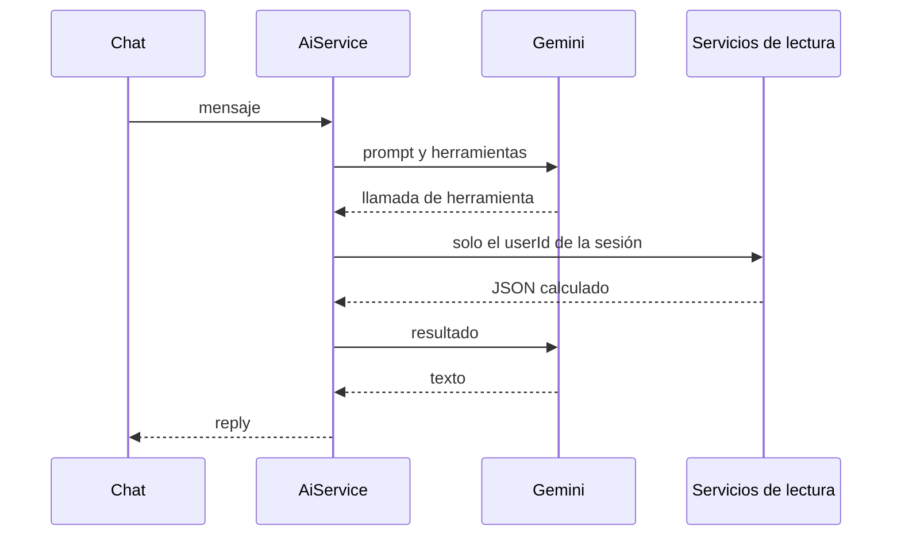

# Analista

Gemini interpreta cifras que ya calculó el backend. No registra, edita ni borra movimientos.

## Configuración

| Variable | Efecto |
| --- | --- |
| `GEMINI_API_KEY` | Vacía: `POST /api/ai/chat` responde `503` con `La IA no está configurada`. El resto de la API sigue. |
| `GEMINI_MODEL` | Por defecto `gemini-2.0-flash`. |

La clave viaja en el encabezado `x-goog-api-key`. No se escribe en logs ni en el cuerpo de error. La espera máxima de una llamada es 20 segundos. Si se agota, la interfaz dice que el analista tardó demasiado. Si no hay red, dice que no se pudo conectar. Un 429 o un 503 del modelo se reintenta una vez y, si sigue, dice que el analista está ocupado. Un 401 o 403 dice que la clave fue rechazada. Un 404 dice que el modelo no está disponible. Una respuesta sin texto dice que no hay datos suficientes. El chat admite como máximo cuatro rondas de herramientas. El aviso llega una vez por Sonner y también queda en el panel.

## Chat

`POST /api/ai/chat` exige sesión. El cuerpo lleva `message` y, si se quiere, `history` con hasta 12 turnos. La respuesta es `{ "reply", "toolsUsed" }`.

El prompt de sistema pide respuestas en español, prohíbe inventar números y prohíbe modificar el libro. El panel muestra el chat en el dashboard, en el riel del activo y en `/analytics`. En móvil el campo y el botón de envío se apilan y mantienen altura táctil.

La clave se escribe solo en `backend/.env`. El frontend no la conoce. Tras cambiarla hay que reiniciar la API.

## Herramientas

Todas leen datos del usuario autenticado:

| Nombre | Qué devuelve |
| --- | --- |
| `list_portfolios` | Portafolios propios. |
| `get_portfolio` | Un portafolio propio. |
| `get_positions` | Posiciones calculadas. |
| `get_transactions` | Libro de ese portafolio. |
| `get_quotes` | Cotizaciones del proveedor. |
| `get_performance` | Serie de valor. |
| `get_allocation` | Pesos de la cartera. |
| `get_benchmark` | Comparación contra un símbolo. |
| `get_news` | Noticias de un símbolo que el usuario tiene. |
| `get_fundamentals` | Fundamentales de un símbolo que el usuario tiene. |

Un nombre desconocido, o cualquiera que intente crear, actualizar o borrar, responde `{ "error": "Operación no permitida" }` y no llama a `TransactionsService`. Noticias y fundamentales de un símbolo que no está en cartera responden que ese símbolo no está entre los activos del usuario.

## Cierre diario

Si hay clave, el correo de cierre pide a Gemini un párrafo que reformule el texto ya calculado, sin herramientas. Si la llamada falla o no hay clave, el correo sale con el texto factual. Gemini no elige qué portafolios entran: eso lo decide `DailyReportService` por `userId`.
