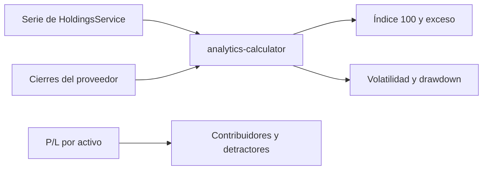

# Analítica

`GET /api/analytics` calcula en el backend. La interfaz en `/analytics` solo presenta el resultado.

## Consulta

| Parámetro | Valores |
| --- | --- |
| `portfolioId` | Opcional. Si falta, se agregan los portafolios que comparten moneda. |
| `range` | `1M`, `3M`, `1Y`, `ALL`. |
| `benchmark` | Símbolo, hasta 20 caracteres. Por defecto `SPY`. |

Si las monedas no coinciden, `aggregated` es `false` y no hay totales inventados.

## Qué devuelve

- Serie de valor del portafolio.
- Comparación indexada a 100 en las fechas que coinciden con el histórico del símbolo de referencia. Sin solape, el benchmark no se inventa.
- Asignación por activo.
- Contribuidores (`P/L > 0`) y detractores (`P/L < 0`). Un resultado de cero no entra en ninguna lista.
- Riesgo: volatilidad anual y caída máxima.

La volatilidad exige al menos cinco variaciones diarias. Es la desviación muestral por la raíz de 252, en porcentaje. La caída máxima es un porcentaje positivo. El índice de concentración (HHI) sale de los pesos de la asignación. Sin posiciones, la concentración queda en `null` y la respuesta incluye el motivo.

Los informes PDF y Excel reutilizan este reporte con rango `1Y` y referencia `SPY`. El correo de cierre usa los mismos contribuidores, detractores y el rendimiento ya calculado.
