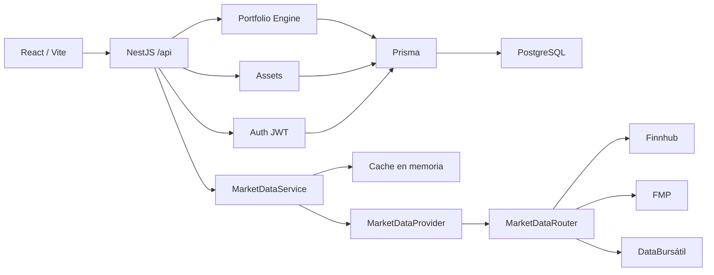
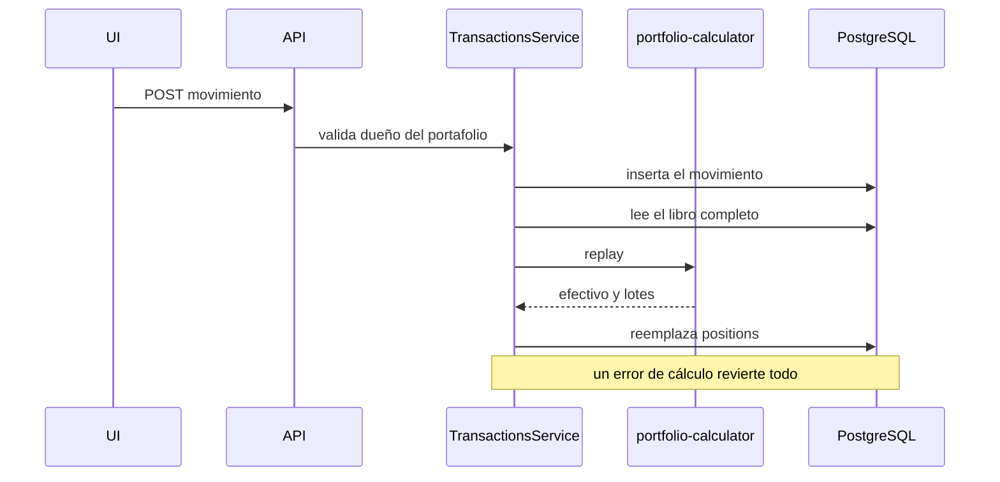
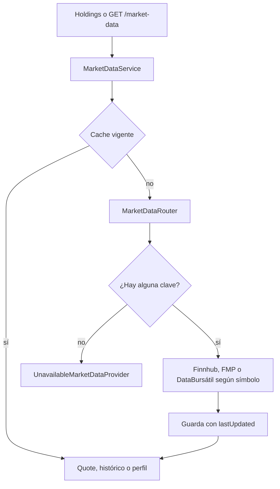
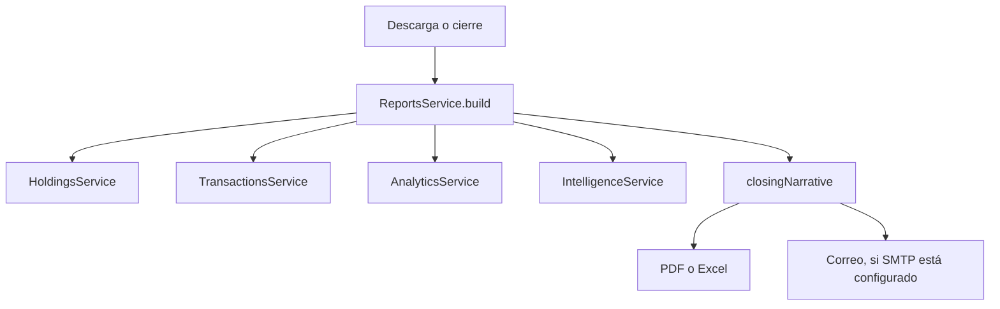

# Arquitectura

InvestAI separa la interfaz, el motor de portafolio y los precios de mercado. El motor no importa Finnhub. Solo pide cotizaciones a `MarketDataService`.



## Módulos del backend

| Módulo | Responsabilidad |
| --- | --- |
| `auth` | Registro, login y `GET /auth/me`. JWT y bcrypt. |
| `users` | Usuario público, sin `passwordHash`. |
| `prisma` | Cliente global de Prisma. |
| `portfolio` | CRUD, propiedad por usuario y cálculos. |
| `assets` | Catálogo global de símbolos. |
| `transactions` | Libro de movimientos y reconstrucción de posiciones. |
| `market-data` | Interfaz de proveedor, Finnhub, FMP, DataBursátil, enrutador, caché y errores. |
| `intelligence` | Perfil, noticias y fundamentales de los activos en cartera. |
| `analytics` | Benchmark, asignación, contribuidores y riesgo. |
| `ai` | Chat con Gemini y herramientas de solo lectura. |
| `reports` | PDF y Excel a partir de los mismos cálculos. |
| `mail` | SMTP opcional. Si falta configuración, no envía y no tumba el proceso. |
| `notifications` | Cierre diario por correo y programación con cron. |
| `alerts` | Umbrales de precio y de rendimiento, aislados por usuario. |

El prefijo global es `api`. `ValidationPipe` descarta campos extra y transforma tipos. CORS acepta solo `FRONTEND_URL`. `helmet` añade cabeceras de seguridad. Un filtro global conserva el cuerpo de `HttpException` y convierte el resto en `500` con un mensaje genérico, sin pila ni secretos. El límite es 120 solicitudes por minuto y, en registro e inicio de sesión, 10. En `NODE_ENV=test` el límite y el cron no se activan.

## Frontend

```text
src/pages          pantallas
src/components     piezas de UI y gráficas
src/layouts        sesión y panel autenticado
src/services       cliente HTTP
src/hooks          datos y tema
src/auth           proveedor de sesión
src/theme          claro / oscuro
src/types          contratos del panel
```

El token se guarda en `localStorage` con la clave `investai.accessToken`. El tema usa `investai.theme` y la clase `dark` en `<html>`. Un script en `index.html` aplica esa clase antes del primer render.

Rutas privadas: `/dashboard`, `/portfolio`, `/portfolio/:id`, `/analytics`, `/market`, `/profile` y `/alerts`. Sin sesión redirigen a `/login`. El panel autenticado usa barra lateral, cinta de índices y, en el dashboard, ficha del activo con buscador, fundamentales, noticias y el analista.

## Flujo del portafolio

Las posiciones no se editan a mano. Cada alta o baja de movimiento reabre el libro completo dentro de la misma transacción de base de datos y vuelve a escribir `positions`. Si el cálculo rechaza el movimiento, la escritura se revierte.



Reglas del replay, con ocho decimales:

- El importe bruto es `quantity * price`. Las comisiones van aparte.
- `DEPOSIT` y `WITHDRAWAL` no llevan activo. El depósito suma al efectivo el neto después de comisión. El retiro resta importe más comisión y falla si no hay efectivo.
- `BUY` exige efectivo suficiente. El costo es `cantidad * precio + comisión`, redondeado a 8 decimales, la misma escala de la base. El costo promedio nuevo es `(cantidad anterior * promedio + costo) / cantidad nueva`.
- La fecha del formulario es un día civil, sin hora. En ese día el libro aplica primero depósitos, luego ventas y dividendos, y después compras y retiros. Dentro de cada grupo manda `createdAt`. Una compra del día anterior al depósito sigue rechazándose.
- Un movimiento con otra moneda no se suma al efectivo: el cálculo responde que no coincide con el portafolio.
- `SELL` no puede superar la cantidad en cartera. El realizado es `(precio - promedio) * cantidad - comisión`. El promedio no cambia.
- `DIVIDEND` suma al efectivo y al realizado `cantidad * precio - comisión`. La cantidad de títulos no cambia.
- `totalPl = portfolioValue - netContributions`.
- `returnPercent = totalPl / depositsIn * 100` cuando hubo depósitos. El denominador es lo depositado, no el neto de aportes, para que retirar utilidades no invierta el porcentaje.
- Sin precio de mercado, la posición se marca al costo promedio, el no realizado queda en cero y `pricesComplete` es falso. El cambio diario solo se suma si todas las posiciones abiertas tienen cotización.
- Si los portafolios de un usuario no comparten moneda, el resumen agregado no se calcula.

## Flujo de datos de mercado



`MARKET_DATA_PROVIDER` acepta `finnhub`, `fmp`, `databursatil` o `composite`. Con cualquiera de esas claves el módulo inyecta `MarketDataRouter`. Sin ninguna clave usa el proveedor no disponible y la API sigue levantando. Un nombre distinto falla al iniciar. El frontend solo habla con `/api/market-data`.

Un 401 no cambia de proveedor. Un 403, 404, 429, 5xx o corte de red sí, si hay otra fuente configurada. El histórico de Estados Unidos pide primero FMP, porque el plan gratuito de Finnhub responde 403 en `/stock/candle`. Las emisoras `.MX`, con `*` o con guion, y el índice `IPC`, piden DataBursátil. El histórico mexicano trae cierre e importe; apertura, máximo y mínimo quedan en `null`.

La misma interfaz entrega noticias y fundamentales. `IntelligenceService` cruza ese resultado con los activos de los portafolios del usuario. No llama a un proveedor concreto.

La clave de Finnhub viaja como `token`, la de FMP como `apikey` y la de DataBursátil como `token`. Ninguna se registra ni se incluye en los mensajes de error. Hay un reintento ante 429, 5xx o corte de red. El caché es en memoria y su TTL sale de `MARKET_DATA_CACHE_TTL_SECONDS` (60 segundos por defecto). Cada quote, vela y perfil incluye `lastUpdated`.

## Analítica y analista

`AnalyticsService` reutiliza la serie de `HoldingsService` y los cierres del proveedor. El índice de referencia, el exceso, los contribuidores y el riesgo salen de `analytics-calculator`. Si faltan observaciones, la métrica queda en `null` con un motivo.

`AiService` llama a Gemini con herramientas de solo lectura. Cada herramienta ejecuta un servicio existente y devuelve el JSON calculado. Una herramienta desconocida, incluida cualquier escritura, responde que la operación no está permitida. La clave viaja en el encabezado `x-goog-api-key` y no se escribe en los errores.

Si una cotización falla, el resumen del portafolio no se cae: esa posición se valúa al costo y `pricesStatus` queda en `partial` o `unavailable`. El Sharpe usa la desviación de los rendimientos diarios con tasa libre de riesgo cero y exige al menos cinco observaciones. La beta contra el benchmark exige al menos cinco pares de rendimientos. Si no hay serie, ambas quedan en `null` y la interfaz muestra un guion.

## Informes, cierre y alertas

El informe no vuelve a calcular. `ReportsService` pide el resumen, la serie, el libro, la analítica de un año contra `SPY` y la inteligencia del portafolio. El texto del cierre sale de esas cifras. PDFKit y ExcelJS solo las presentan.



El cron usa la librería `cron` y se registra al arrancar. `DAILY_REPORT_CRON` por defecto es `0 22 * * 1-5` y `ALERT_CRON` es `0 * * * *`, en `REPORT_TIMEZONE` (`America/Mexico_City`). Una expresión inválida se registra en el log y el proceso sigue. En `NODE_ENV=test` no se programa ninguna tarea. Cada usuario recibe solo sus portafolios. Gemini, si hay clave, reformula ese texto y no aporta cifras nuevas. Si la reformulación falla, se envía el texto calculado.

Una alerta de precio exige símbolo. Una de rendimiento exige un portafolio del usuario. Si falta la cotización o el rendimiento, esa alerta se omite. Tras un aviso, `lastTriggeredAt` espera `ALERT_COOLDOWN_HOURS` (24). El correo se intenta después; si SMTP no está listo, la alerta igual queda marcada para no repetirse en el mismo ciclo.
