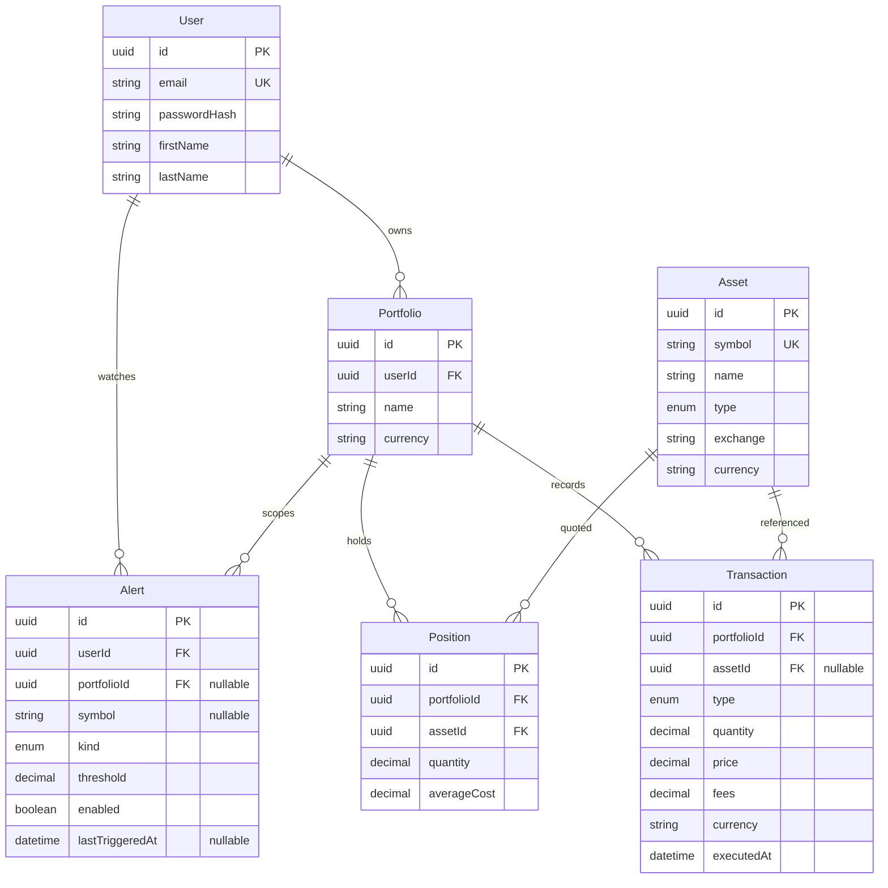

# Base de datos

PostgreSQL 16 y Prisma 6. El cliente se genera en `node_modules/@prisma/client`. El esquema está en `backend/prisma/schema.prisma`.



## Tablas

Los nombres físicos son `users`, `portfolios`, `assets`, `positions`, `transactions` y `alerts`. Los identificadores son UUID.

| Modelo | Notas |
| --- | --- |
| `User` | El correo es único y se guarda en minúsculas. `passwordHash` no sale en la API. |
| `Portfolio` | Pertenece a un usuario. `currency` es un código de letras, por ejemplo `USD`. |
| `Asset` | Catálogo global. `symbol` es único en mayúsculas. Tipos: `STOCK`, `ETF`, `CRYPTO`, `FOREX`, `OTHER`. |
| `Position` | Derivada del libro. Única por `(portfolioId, assetId)`. Una cantidad en cero no se guarda. |
| `Transaction` | `BUY`, `SELL`, `DIVIDEND`, `DEPOSIT`, `WITHDRAWAL`. `assetId` es nulo en depósitos y retiros. |
| `Alert` | `PRICE_ABOVE`, `PRICE_BELOW`, `RETURN_ABOVE`, `RETURN_BELOW`. El umbral es `Decimal(18, 8)`. `enabled` nace en `true`. |

Los decimales de dinero y cantidad usan `Decimal(18, 8)`.

## Relaciones y borrado

- Borrar un usuario borra sus portafolios y alertas.
- Borrar un portafolio borra sus posiciones, movimientos y alertas ligadas a él.
- Borrar un activo está restringido si tiene posiciones o movimientos.
- Un portafolio ajeno se responde como `404`. No se distingue de uno inexistente.

## Migraciones

| Carpeta | Efecto |
| --- | --- |
| `20261002031335_init` | Crea usuarios, portafolios, activos, posiciones y movimientos. |
| `20261002040500_transaction_asset_optional` | Hace opcional `transactions.assetId` y vuelve único `assets.symbol`. |
| `20261002050000_alerts` | Crea el enum `AlertKind` y la tabla `alerts`. |

Aplicarlas:

```powershell
npm run db:migrate
```

Ese script ejecuta `prisma migrate dev` dentro de `backend`. En un entorno sin terminal interactiva, usa `npx prisma migrate deploy` desde `backend` contra la misma `DATABASE_URL`.

## Invariantes que no están solo en la base

- La moneda de un movimiento es siempre la del portafolio.
- No se cambia la moneda del portafolio si ya hay movimientos.
- Un símbolo que ya existe no puede crearse otra vez con otra moneda: la API responde conflicto.
- El efectivo no puede quedar negativo. Una compra o un retiro sin fondos se rechaza y no deja filas a medias.
