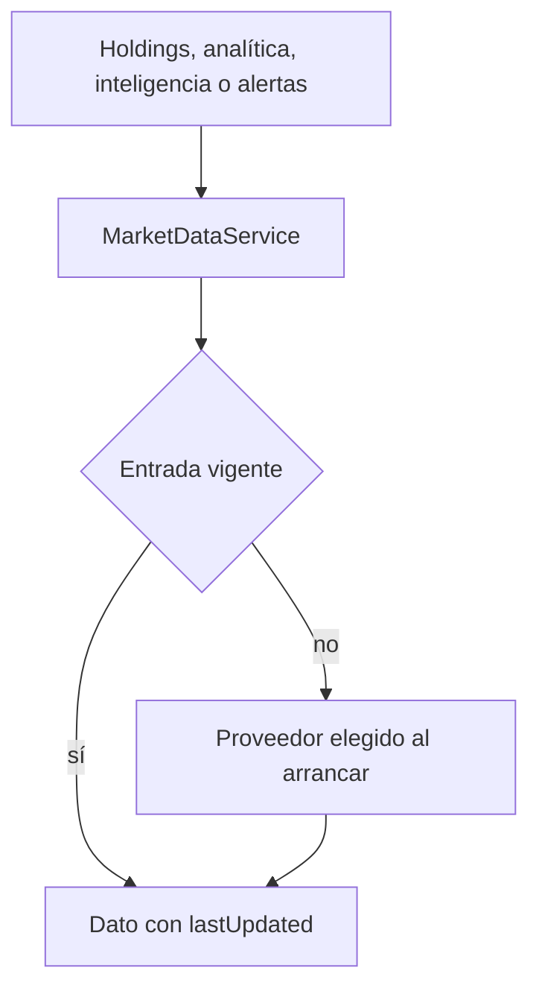
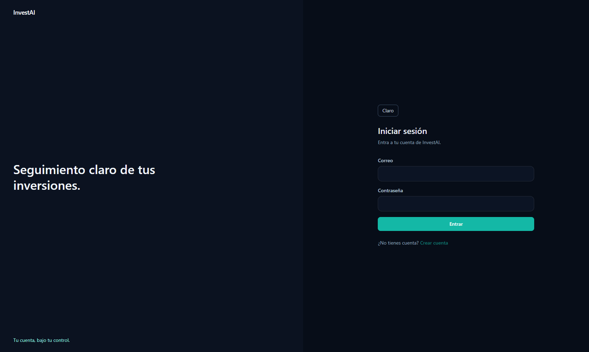
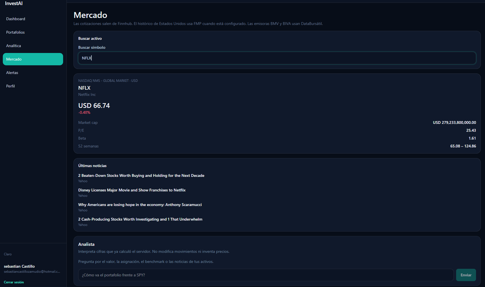
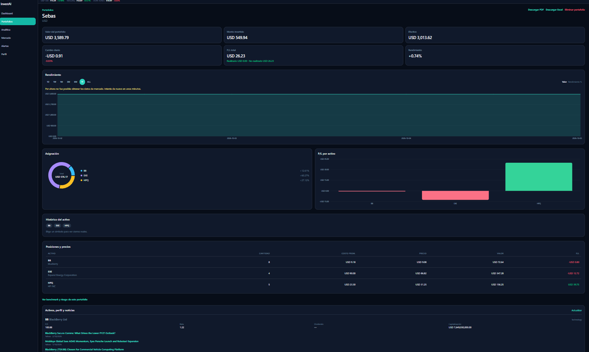
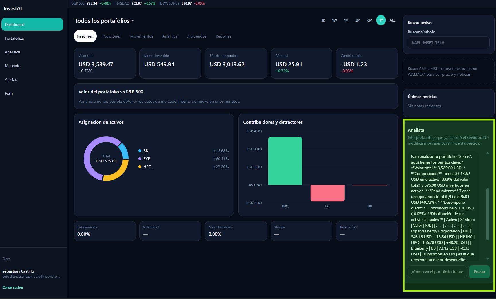

# Datos de mercado

El motor de portafolio, la analítica, los informes y las alertas piden precios a `MarketDataService`. Ninguno importa Finnhub.

## Proveedor

`MarketDataProvider` declara cotizaciones, histórico, perfil, noticias y fundamentales. La fábrica de `MarketDataModule` elige la clase al arrancar:

| `MARKET_DATA_PROVIDER` | Claves | Implementación |
| --- | --- | --- |
| `finnhub`, `fmp`, `databursatil` o `composite` | al menos una de `FINNHUB_API_KEY`, `FMP_API_KEY`, `DATABURSATIL_TOKEN` | `MarketDataRouter` |
| esos mismos | ninguna clave | `UnavailableMarketDataProvider` |
| otro valor | cualquiera | el proceso no arranca |

Finnhub sigue siendo la fuente principal de cotizaciones, noticias y perfil. FMP aporta el histórico EOD cuando la clave existe. DataBursátil atiende emisoras de BMV y BIVA. `MarketDataRouter` implementa `MarketDataProvider` y elige:

| Dato | Símbolo de EE. UU. | Emisora `.MX`, `*` o con guion, e IPC |
| --- | --- | --- |
| Cotización | Finnhub y, si responde 404, 403 o 429, FMP | DataBursátil y después el mismo fallback |
| Histórico OHLC | FMP. Si FMP falla y no es un 401, Finnhub | DataBursátil. Sin token, el histórico mexicano no se inventa |
| Noticias y perfil | Finnhub | DataBursátil para noticias generales y ficha MXN |
| Búsqueda | Finnhub, FMP y DataBursátil, sin símbolos repetidos | Igual |

Un 401 no se esconde con otro proveedor: se registra en el log del backend y no se intenta el siguiente. El cliente recibe un solo texto: `Por ahora no fue posible obtener los datos de mercado. Intenta de nuevo en unos minutos.` Lo mismo ocurre con 403, 404, 429, 5xx, timeout o corte de red cuando ya no queda otro proveedor configurado para esa consulta. El log guarda el status y el mensaje técnico, sin la clave. La interfaz muestra ese aviso una sola vez; un fallo intermedio de Finnhub no dispara un toast si FMP o DataBursátil respondieron.

Sin clave, las rutas de mercado informan que el proveedor no está configurado. El portafolio se valúa al costo, `pricesStatus` queda en `unavailable` y la aplicación sigue.

## Finnhub

La clave va solo como parámetro `token`. No aparece en errores ni en logs.

| Método | Ruta de Finnhub |
| --- | --- |
| Cotización | `/quote` |
| Histórico diario OHLC | `/stock/candle` con resolución `D` |
| Búsqueda | `/search` |
| Sesión de una fecha | el mismo histórico, recortado a la fecha pedida |
| Perfil | `/stock/profile2` |
| Noticias | `/company-news` |
| Fundamentales | `/stock/metric` con `metric=all` |

`marketCapitalization` llega en millones y se guarda en unidades absolutas. Un fundamental ausente es `null`, no cero. Cada llamada espera como máximo 8 segundos. Un fallo parcial de cotizaciones no tumba el resumen: las posiciones sin precio se marcan y `pricesStatus` puede ser `partial`.

## Errores de Finnhub

La clave y la URL no se escriben en logs ni en la respuesta. El log interno sí guarda el status y el mensaje que devolvió Finnhub, con el token reemplazado.

| Status | Mensaje hacia la interfaz |
| --- | --- |
| sin clave | Los datos de mercado no están configurados |
| 401 | La clave de Finnhub fue rechazada |
| 403 en `/stock/candle` | Finnhub denegó las velas históricas. El plan de esta clave no incluye `/stock/candle`. Las cotizaciones en vivo siguen disponibles. |
| 403 en otro recurso | Finnhub denegó el acceso a este recurso |
| 404 | Finnhub no encontró ese recurso, o no hay cotización para el símbolo |
| 429 | Finnhub limitó las consultas. Espera un momento y vuelve a intentar. |
| 5xx | Finnhub no está disponible en este momento |
| red o timeout | No se pudo conectar con Finnhub, o no respondió a tiempo |

Con la clave actual, `quote` de SPY, AAPL, BB y EXE responde 200. `stock/candle` responde 403 `You don't have access to this resource` para todos. No es un símbolo mal formado ni una clave ausente: el plan gratuito no incluye velas. Tras el primer 403, las siguientes velas se rechazan en memoria para no repetir la llamada.

## FMP

La clave va como `apikey` contra `https://financialmodelingprep.com/stable/`. No se usa `/api/v3/historical-price-full`.

| Método | Ruta |
| --- | --- |
| Cotización | `/quote` |
| Histórico EOD | `/historical-price-eod/full` |
| Búsqueda | `/search-symbol` |
| Perfil y fundamentales | `/profile` |

Un arreglo vacío de barras es una respuesta válida: no se inventan velas. FMP no es fuente de noticias.

## DataBursátil

El token va como `token` contra `https://api.databursatil.com/v2/`. Solo GET.

| Método | Ruta |
| --- | --- |
| Cotización | `/cotizaciones` con `concepto=U,C,M,A` y `bolsa=BMV,BIVA` |
| IPC | `/indices?ticker=IPC` |
| Histórico | `/historicos` |
| Búsqueda | `/emisoras` |
| Noticias | `/noticias` |

El histórico mapea `precio` al cierre e `importe` al volumen. Apertura, máximo y mínimo quedan en `null`. Los precios se tratan como MXN. Una emisora mexicana es la que termina en `.MX` o `*`, contiene `-`, o es `IPC`.

## Sesión de compra

Si una fecha cae en fin de semana o feriado y sí hay velas, se informa que no hubo sesión y se ofrece el último cierre anterior. No se inventa un precio. El usuario puede cambiar el precio sugerido por el ejecutado.

`GET /api/market-data/search?q=` devuelve símbolo, nombre, tipo, exchange, moneda, precio y variación. `GET /api/market-data/history/:symbol/session?date=AAAA-MM-DD` devuelve el OHLC de esa sesión.

## Caché

El caché es en memoria. El TTL sale de `MARKET_DATA_CACHE_TTL_SECONDS` y por defecto es 60. Cotizaciones, histórico, perfil, noticias y fundamentales incluyen `lastUpdated`.

## Inteligencia

`GET /api/intelligence` y `GET /api/intelligence?portfolioId=` arman perfil, noticias y fundamentales solo con símbolos de los portafolios del usuario, con un máximo de 15. Un fallo de un activo no quita a los demás. Un `portfolioId` ajeno responde `404`.

## Como luce InvestIA

 Invierte con Anilisis del mercado en timepo real

| Inicio | Dashboard |
| --- | --- |
|  |  |

| Portafolio | InvestIA |
| --- | --- |
|  |  |
